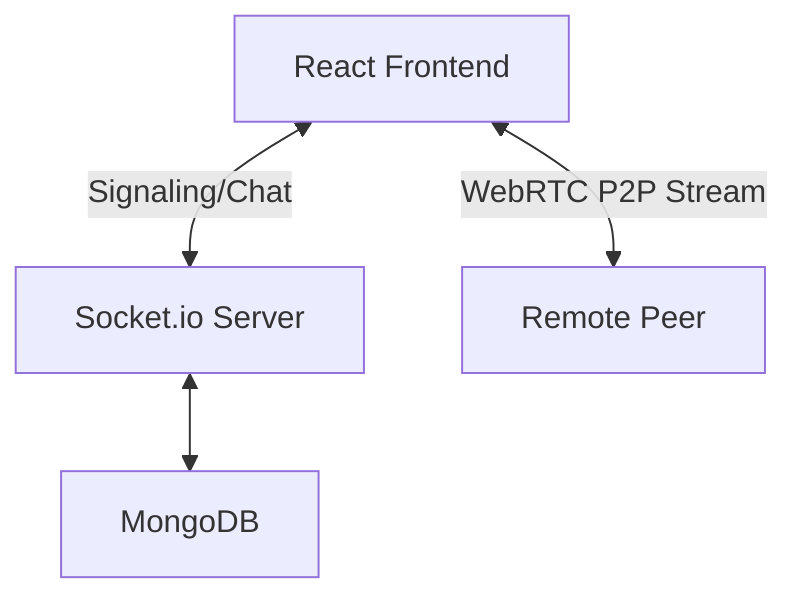

# 🔗 LinkUp | Real-Time Connection Platform

**LinkUp** is a high-performance, real-time communication platform designed to bring people closer. Moving beyond simple "meetings," LinkUp focuses on **moments**—combining instant messaging, live presence detection, and low-latency WebRTC video conferencing with screen sharing.

---

## 🚀 Features

### 🔐 Authentication & Onboarding

* **Google OAuth 2.0:** Secure, one-tap login.
* **Smart Onboarding:** Personalized username setup for new souls.


### 💬 Heart-to-Heart Messaging

* **Instant Chat:** Real-time exchange powered by Socket.io.
* **Media Sharing:** Image uploads integrated with Cloudinary.
* **Fluid UX:** Typing indicators and live message timestamps.

### 🌐 Live Presence System

* **Presence Detection:** Real-time online/offline status.
* **Smart Notifications:** Get alerted the moment your connections hop online.

### 📹 High-Fidelity Video

* **P2P WebRTC:** Low-latency 1:1 video and audio.
* **Collaborative Tools:** Integrated Screen Sharing.
* **Media Privacy:** Granular toggles for Camera and Microphone.

---

## 🏗️ System Architecture

LinkUp utilizes a **Hybrid Mesh Architecture**. While chat data and signaling metadata pass through our Node.js relay, the heavy video/audio data travels Peer-to-Peer (P2P) for maximum privacy and speed.



---

## 🛠️ Tech Stack

| Layer | Technology |
| --- | --- |
| **Frontend** | React.js, Material UI, WebRTC API, Socket.io-client |
| **Backend** | Node.js, Express.js, Socket.io |
| **Database** | MongoDB (Mongoose ODM) |
| **Auth** | Google OAuth 2.0 (Passport.js) |


---

## 📂 Project Structure & Documentation

LinkUp is split into three main modules:

1. 💻 **[linkup-frontend](file:///Users/sakshamtripathi/Desktop/Video-Confrencing/linkup-frontend/README.md)** - React (Vite) client implementation utilizing WebRTC, WebSockets, and Material-UI (MUI).
2. ⚙️ **[Backend](file:///Users/sakshamtripathi/Desktop/Video-Confrencing/Backend/README.md)** - Node.js/Express server and Socket.io signaling orchestrator.
3. 📚 **[Notes](file:///Users/sakshamtripathi/Desktop/Video-Confrencing/Notes/README.md)** - Documentation covering video conferencing architectures, STUN/TURN setups, computer networking transport layers, and WebSockets.

---

## ⚡ Quick Start

### 1. Clone the repository
```bash
git clone https://github.com/Saksham-Xtreme/LinkUp.git
cd LinkUp
```

### 2. Run the Backend Server
Please view the detailed **[Backend Setup Guide](file:///Users/sakshamtripathi/Desktop/Video-Confrencing/Backend/README.md)**.
```bash
cd Backend
npm install
# Configure your .env file
npm run dev
```

### 3. Run the Frontend Client
Please view the detailed **[Frontend Setup Guide](file:///Users/sakshamtripathi/Desktop/Video-Confrencing/linkup-frontend/README.md)**.
```bash
cd linkup-frontend
npm install
# Configure your .env file
npm run dev
```

---

## 🔐 Environment Variables Summary

Detailed list of variables required to configure the system:

### Backend `.env`
* `PORT` - The port on which the Express server listens (e.g., `8000`).
* `MONGO_URI` - MongoDB database connection string.
* `JWT_SECRET` - Random secret key for signing JWT login tokens.
* `JWT_EXPIRES_IN` - Lifetime duration of the token (e.g., `7d`).
* `CLIENT_URL` - Origin URL of the frontend (e.g., `http://localhost:5173`).
* `GOOGLE_CLIENT_ID` - Client ID generated from Google Developer Console for Google Sign-In.
* `GOOGLE_CLIENT_SECRET` - Client Secret generated from Google Developer Console.

### Frontend `.env`
* `VITE_BACKEND_URL` - Endpoint of the running Backend server (e.g., `http://localhost:8000`).

---

## 👨‍💻 Author

**Saksham Tripathi** *Full Stack Developer | Computer Science Engineering Student* [GitHub](https://github.com/Saksham-Xtreme) | [LinkedIn](https://www.linkedin.com/in/saksham-tripathi-303728282/)


