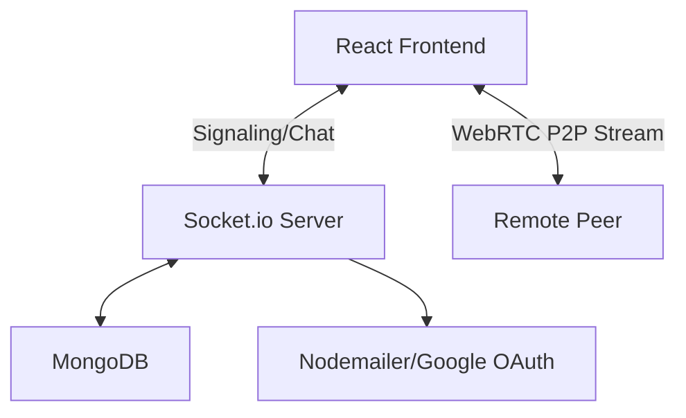

# 🔗 LinkUp | Real-Time Connection Platform

**LinkUp** is a high-performance, real-time communication platform designed to bring people closer. Moving beyond simple "meetings," LinkUp focuses on **moments**—combining instant messaging, live presence detection, and low-latency WebRTC video conferencing with screen sharing.

---

## 🚀 Features

### 🔐 Authentication & Onboarding

* **Google OAuth 2.0:** Secure, one-tap login.
* **Smart Onboarding:** Personalized username setup for new souls.
* **Automated Welcome:** Instant email confirmation via Nodemailer.

### 💬 Heart-to-Heart Messaging

* **Instant Chat:** Real-time exchange powered by Socket.io.
* **Media Sharing:** Image uploads integrated with Cloudinary.
* **Fluid UX:** Typing indicators and live message timestamps.

### 🌐 Live Presence System

* **Presence Detection:** Real-time online/offline status.
* **Smart Notifications:** Get alerted the moment your connections hop online.

### 📹 High-Fidelity Video

* **P2P WebRTC:** Low-latency 1:1 video and audio.
* **Collaborative Tools:** Integrated Screen Sharing.
* **Media Privacy:** Granular toggles for Camera and Microphone.

---

## 🏗️ System Architecture

LinkUp utilizes a **Hybrid Mesh Architecture**. While chat data and signaling metadata pass through our Node.js relay, the heavy video/audio data travels Peer-to-Peer (P2P) for maximum privacy and speed.



---

## 🛠️ Tech Stack

| Layer | Technology |
| --- | --- |
| **Frontend** | React.js, Material UI, WebRTC API, Socket.io-client |
| **Backend** | Node.js, Express.js, Socket.io |
| **Database** | MongoDB (Mongoose ODM) |
| **Auth** | Google OAuth 2.0 (Passport.js) |
| **Storage/Mail** | Cloudinary, Nodemailer |

---

## 📂 Project Structure

```text
linkup
├── client (React)
│   ├── src/hooks       # Custom WebRTC & Auth hooks
│   ├── src/contexts    # Global State Management
│   └── src/pages       # Lobby, Home, and Meeting Rooms
└── server (Node.js)
    ├── sockets/        # Socket.io event handlers
    ├── models/         # MongoDB Schemas (User, History)
    └── controllers/    # Business logic for Auth & Calls

```

---

## ⚡ Quick Start

### 1. Clone & Install

```bash
git clone https://github.com/Saksham-Xtreme/LinkUp.git
cd LinkUp

```

### 2. Setup Server

```bash
cd server
npm install
# Create .env with the keys listed below
npm run dev

```

### 3. Setup Client

```bash
cd client
npm install
npm run dev

```

---

## 🔐 Environment Variables

Create a `.env` file in the `/server` directory:

```env
PORT=8000
MONGO_URI=your_mongodb_connection_string
JWT_SECRET=your_random_secret_key
GOOGLE_CLIENT_ID=your_google_id
GOOGLE_CLIENT_SECRET=your_google_secret
EMAIL_USER=your_gmail@gmail.com
EMAIL_PASS=your_app_specific_password

```

---

## 👨‍💻 Author

**Saksham Tripathi** *Full Stack Developer | Computer Science Engineering Student* [GitHub](https://www.google.com/search?q=https://github.com/Saksham-Xtreme) | [LinkedIn](https://www.google.com/search?q=https://www.linkedin.com/in/saksham-tripathi-303728282/)


